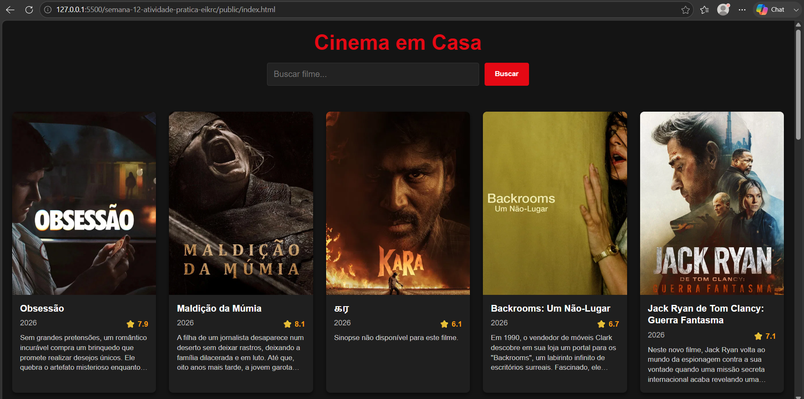
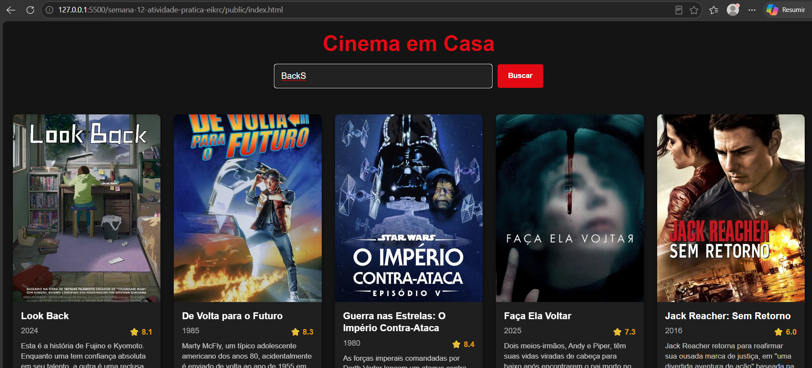

# Trabalho Prático - Semana 12

Nesta atividade, vamos trabalhar com uma API de mercado para montar uma interface de visualização de filmes. Para isso, vamos utilizar a [The Movie DB API](https://developer.themoviedb.org/docs/getting-started). A página resultante deve listar os resultados de uma requisição HTTP no formato de cards e deve incluir uma funcionalidade de pesquisa ou filtro. 

## Informações Gerais

- Nome: Erick Calixto David Silva
- Matricula: 1628583

## Prints do trabalho

## Endpoint Escolhido
* **Listagem Inicial (Padrão):** `GET /movie/popular` — Retorna a lista dos filmes mais populares do momento para preencher a tela assim que o usuário acessa o site.
* **Mecanismo de Busca:** `GET /search/movie` — Ativado dinamicamente quando o usuário digita
